## DTE | Магазин цифровой и бытовой техники

 

> [!IMPORTANT]
> ip-адрес сайта меняется каждые 24 часа

### Технологии

- Создан с помощью фреймворка: ***Django 6.0***  
- База данных ***SQLite3 + Django ORM***.  
- Логирование: ***Grafana + Loki***.  
- Профилирование: ***Django debug toolbar***.  
- Проверка форматирования: ***flake8***.  
- Проверка аннотаций с помощью: ***Pylance***.  
- Осуществлена локализация и интернационализация приложения.  
- При создании API и интерактивной документации использованы технологии: ***Django REST Framework***, ***DRF-spectacular***.  

### Скриншоты

<table>
  <tr>
    <td>
      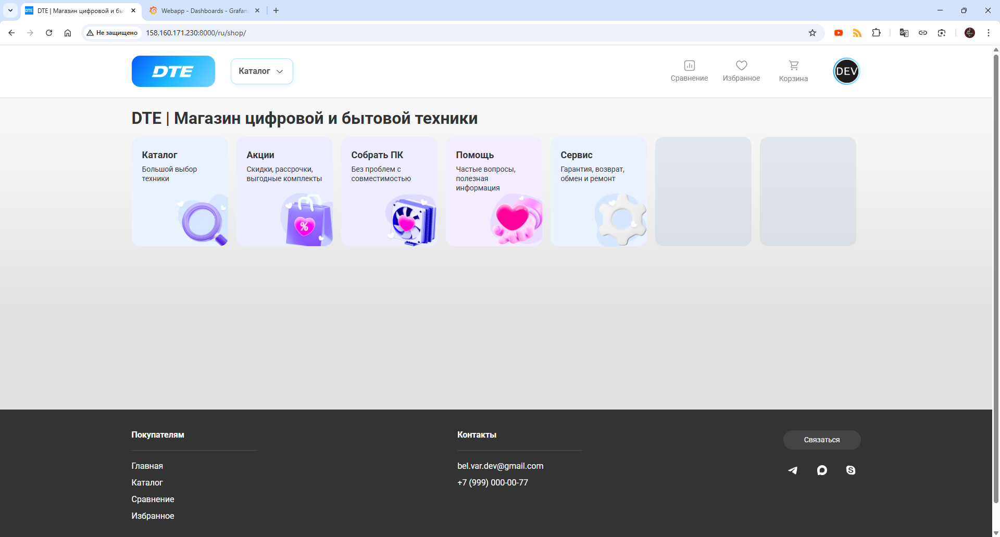
      
Главная страница

    </td>
    <td>
      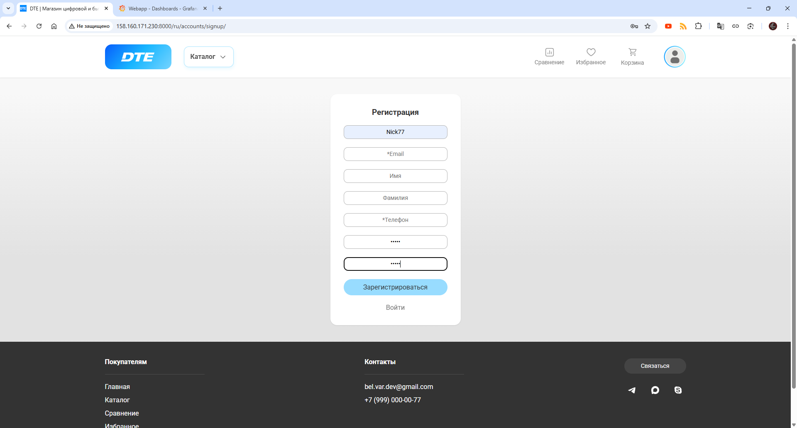
      
Регистрация

    </td>
    <td>
      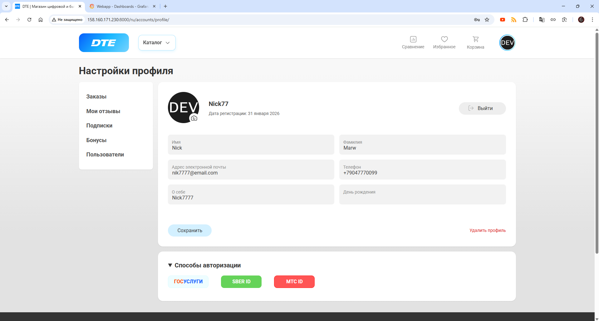
      
Профиль 

    </td>
  </tr>
  <tr>
    <td>
      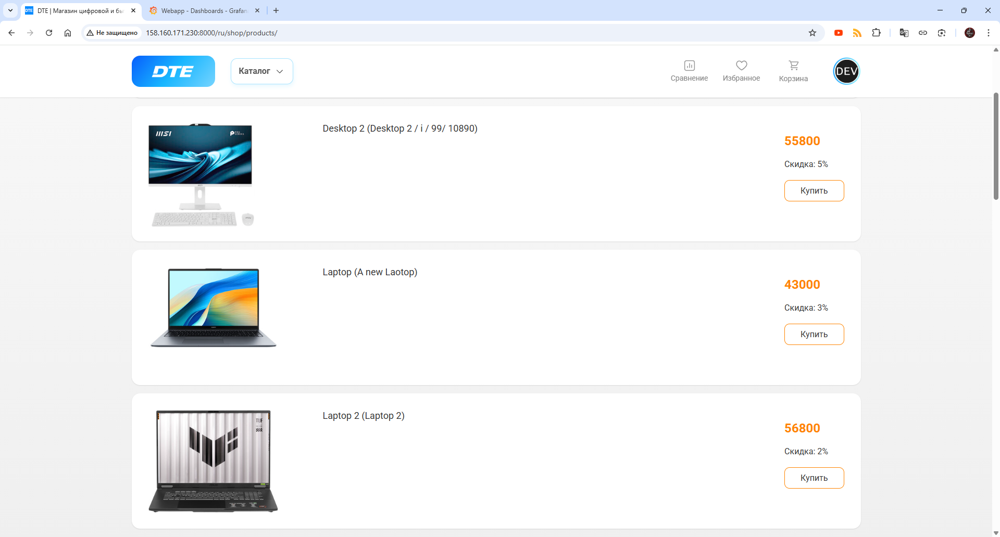
      
Каталог

    </td>
    <td>
      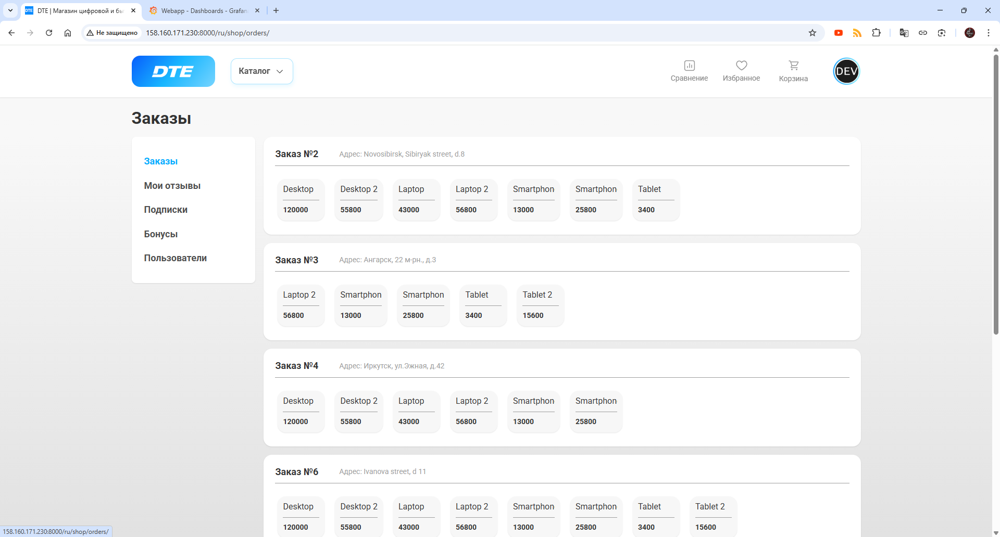
      
Заказы

    </td>
    <td>
      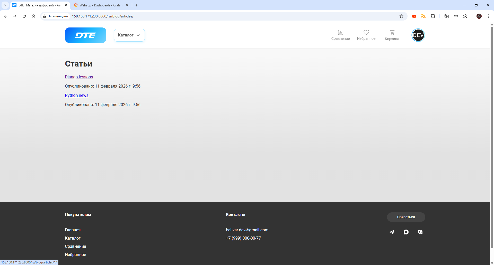
      
Статьи

    </td>
  </tr>
  <tr>
    <td>
      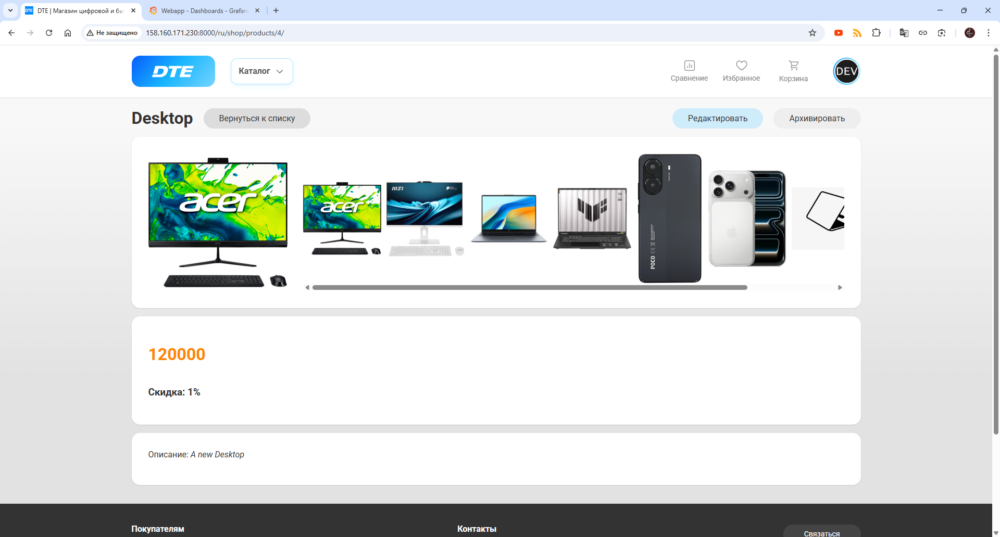
      
Карточка продукта

    </td>
    <td>
      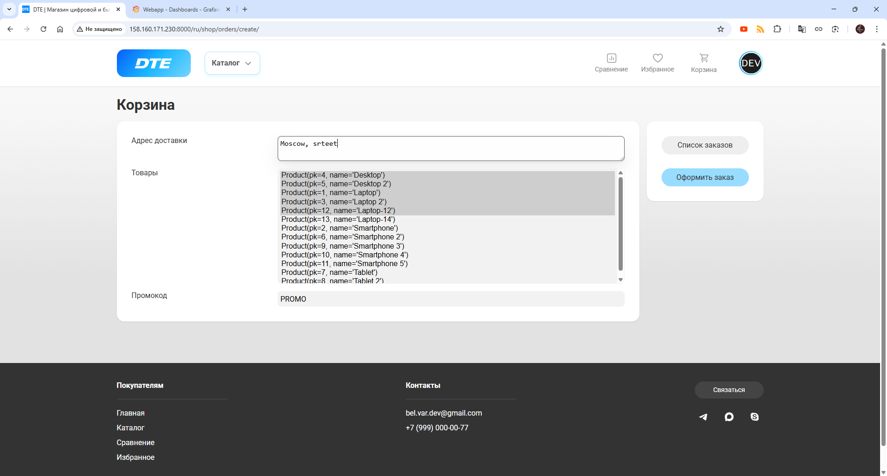
      
Создание заказа

    </td>
    <td>
      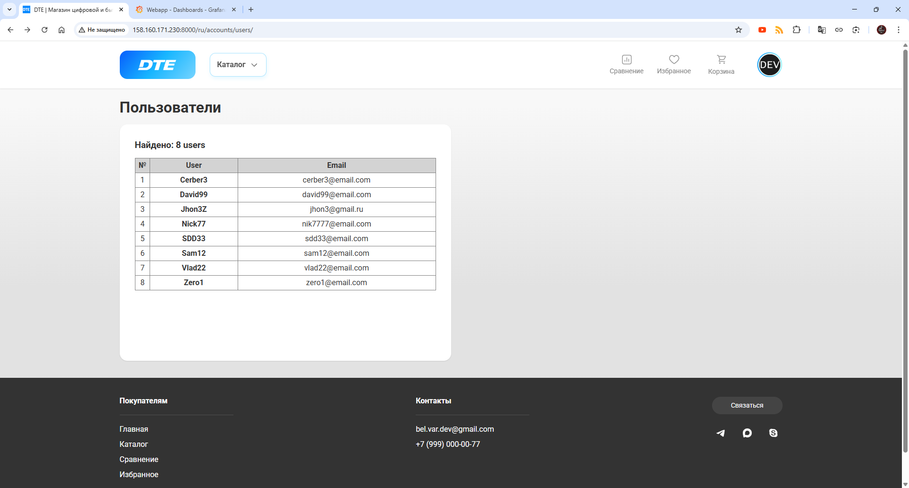
      
Список пользователей

    </td>
  </tr>
</table>
 
<table>
  <tr>
    <td>
      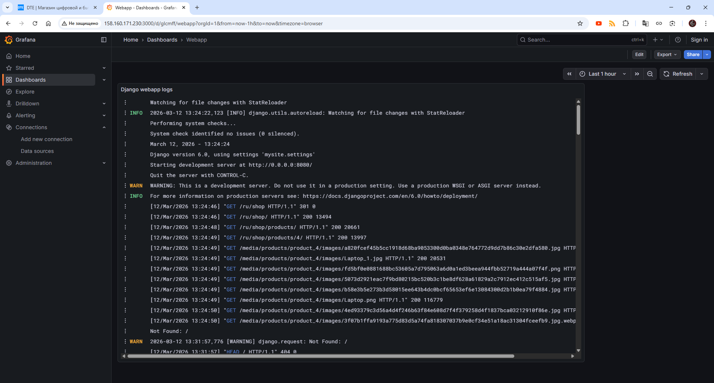
      
Логи в Grafana + Loki

    </td>
    <td>
      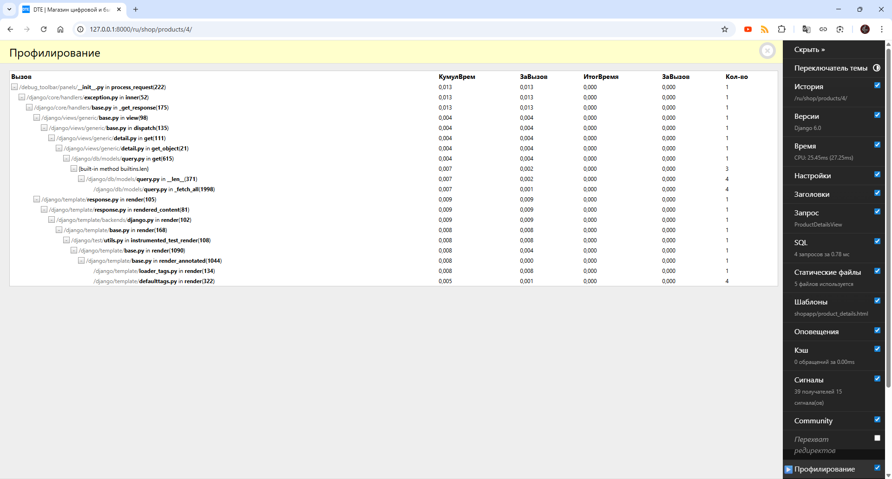
      
Debug toolbar

    </td>
    <td>
      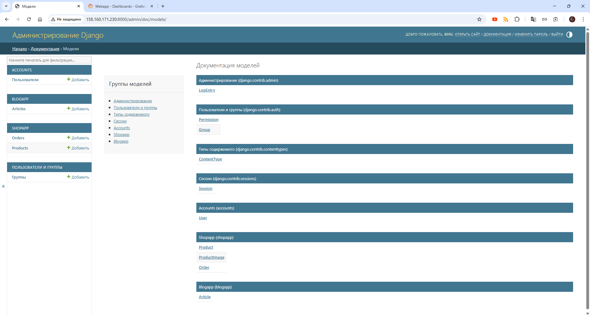
      
Документация в админ. панели

    </td>
  </tr>
  <tr>
    <td>
      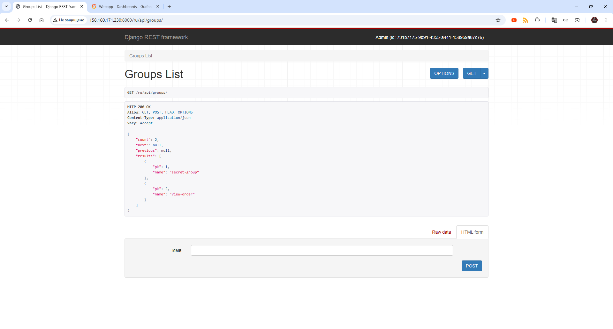
      
REST Framework

    </td>
    <td>
      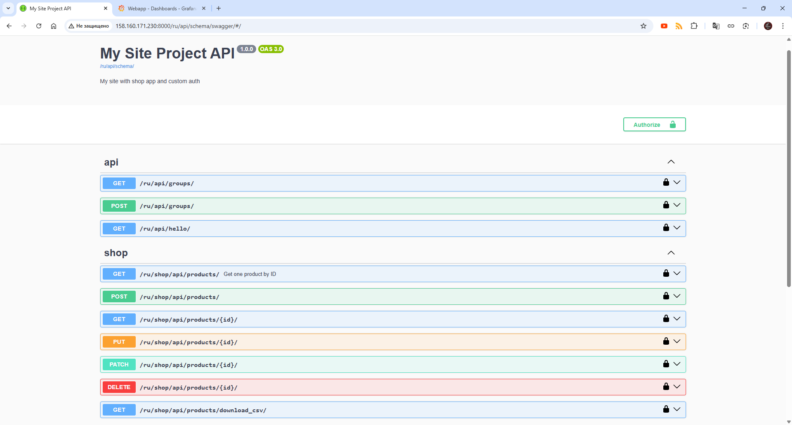
      
Swagger документация

    </td>
    <td>
      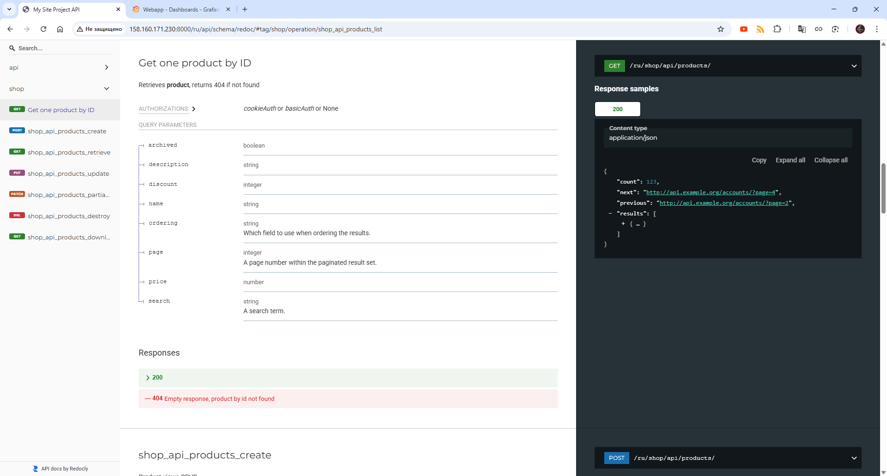
      
Redoc документация

    </td>
  </tr>
</table>

 
 
 

  

